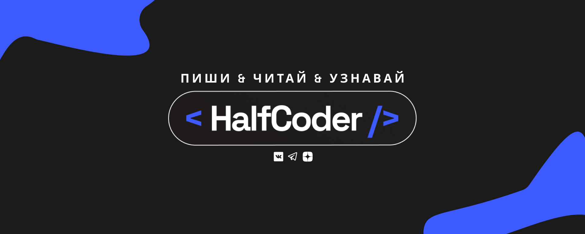
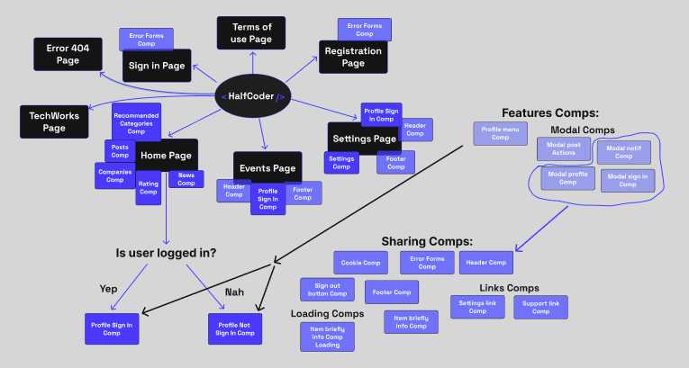

Это проект сайта, который объединит всех разработчиков под одной крышей, чтобы мы могли спокойно пообсуждать общие темы, поспорить о вечном и наконец-то разобраться с будущем программирования.

#### Что реализовано: 
- Главная страница с функционалом
- Есть ссылки на наши соцсети в Вк, Дзен и Телеграм
- На сайте присутствует пользовательское соглашение
- Система авторизации

#### Что планируется: 
1. Доработать сайт до PWA
2. Заниматься его поддержкой и улучшением

#### Взаимосвязь компонентов:

#### Наш технологический стэк:
- #### Frontend
  - Nuxt3 + Pinia
  - TypeScript 
  - Scss
- #### Backend 
  - Python Django
  - MySQL

#### Используемые библиотеки:
- Axios
- Vuex-persistedstate
- Flatpickr
- Composition API

### Создатели проекта: 

Frontend: https://github.com/RoastedPikachu
Backend: https://github.com/allelleo

Если у вас возникают какие-либо баги, то пишите на эту почту: **boriskarabytwork@gmail.com**